# Git Industry Level Commands Documentation

## 1. Git Configuration Commands

### git config --global user.name

**Syntax:**
git config --global user.name "Your Name"

**Purpose:**
Sets the global username that will appear in your Git commits.

**Example:**
git config --global user.name "Santoshi-220430"

**Output Screenshot:**
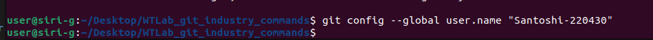

### git config --global user.email

**Syntax:**
git config --global user.email

**Purpose:**
Sets the global email address that will appear in your Git commits.

**Example:**
git config --global user.email "n220430@rguktn.ac.in"

**Output Screenshot:**
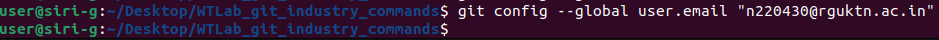

### git config --unset user.name

**Syntax:**
git config --global --unset user.name

**Purpose:**
Removes the configured username from Git global settings.

**Example:**
git config --global --unset user.name

**Screenshot Proof:**

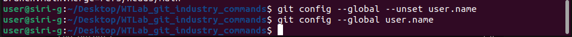

### git config --list

**Purpose:**
Displays all the Git configuration settings currently applied.

**Output Screenshot:**
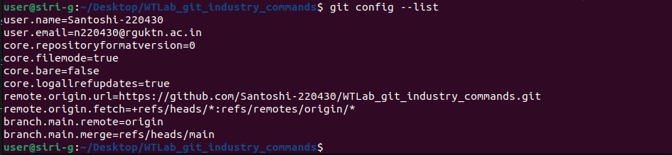

## Repository set up commands

### git init

**Purpose:**
Creates a new Git repository in the current folder.

**Output Screenshot:**
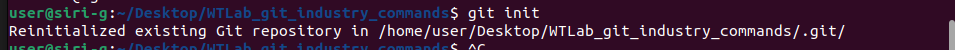

### git clone

**Syntax:**
git clone <repository-URL>

**Purpose:**
Creates a local copy of a remote repository.

**Example:**
git clone https://github.com/Santoshi-220430/WTLab_git_industry_commands.git

**Screenshot Proof:**

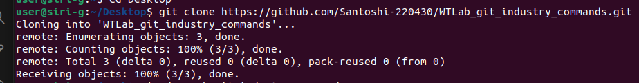

### git clone --branch

**Syntax:**
git clone --branch <branch-name> <repository-URL>

**Purpose:**
Clones a specific branch from a remote repository instead of the default branch.

**Example:**
git clone --branch feature-demo https://github.com/Santoshi-220430/WTLab_git_industry_commands.git branch_clone_demo

**Screenshot Proof:**

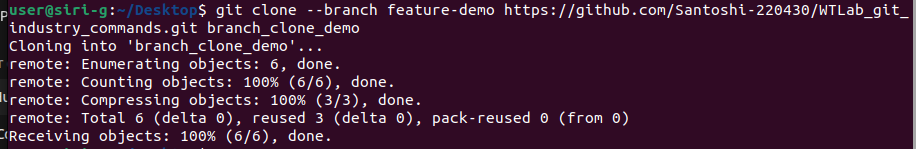

### git clone --depth

**Syntax:**
git clone --depth <number> <repository-URL>

**Purpose:**
Creates a shallow clone by downloading only a limited number of recent commits instead of the full repository history.

**Example:**
git clone --depth 1 https://github.com/Santoshi-220430/WTLab_git_industry_commands.git shallow_clone_demo

**Screenshot Proof:**

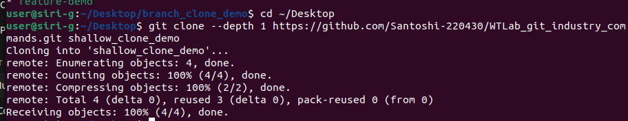

## Repository Status & Inspection

### git status

**Syntax:**
git status

**Purpose:**
Displays the current state of the working directory and staging area.

**Example:**
git status

**Screenshot Proof:**

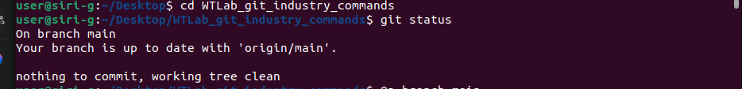

### git log

**Syntax:**
git log

**Purpose:**
Displays the commit history of the repository.

**Example:**
git log

**Screenshot Proof:**

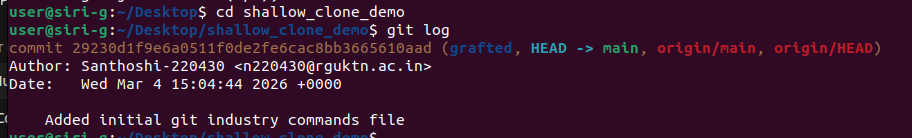

### git log --oneline

**Syntax:**
git log --oneline

**Purpose:**
Displays commit history in compact format showing short commit ID and message.

**Example:**
git log --oneline

**Screenshot Proof:**

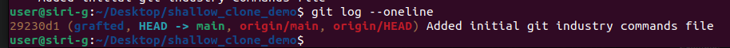

### git log --graph

**Syntax:**
git log --graph 

**Purpose:**
Displays commit history in graphical tree format showing branches and merges.

**Example:**
git log --graph 

**Screenshot Proof:**

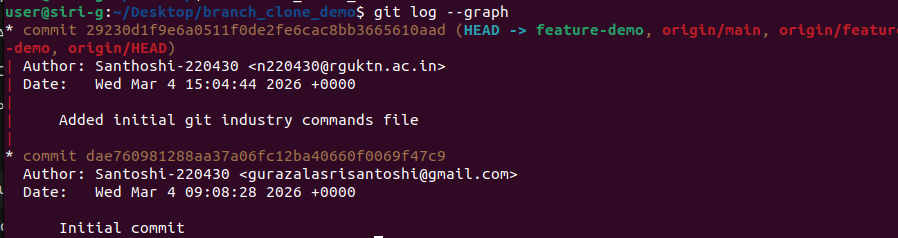
### git show

**Syntax:**
git show
git show <commit-id>

**Purpose:**
Displays detailed information about a specific commit including changes made.

**Example:**
git show 29230d1

**Screenshot Proof:**

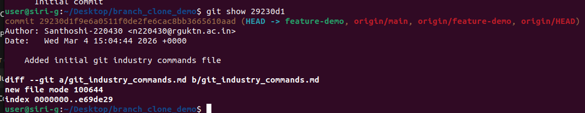

### git diff

**Purpose:**
Shows changes made in files that are not yet staged.

**Output Screenshot:**

### git diff --staged

**Purpose:**
Shows changes that are staged but not yet committed.

**Output Screenshot:**

### git blame

**Purpose:**
Shows who last modified each line of a file.

**Output Screenshot:**

### git reflog

**Purpose:**
Displays the history of all HEAD movements and actions.

**Output Screenshot:**

### git shortlog

**Purpose:**
Summarizes commit history grouped by author.

**Output Screenshot:**
